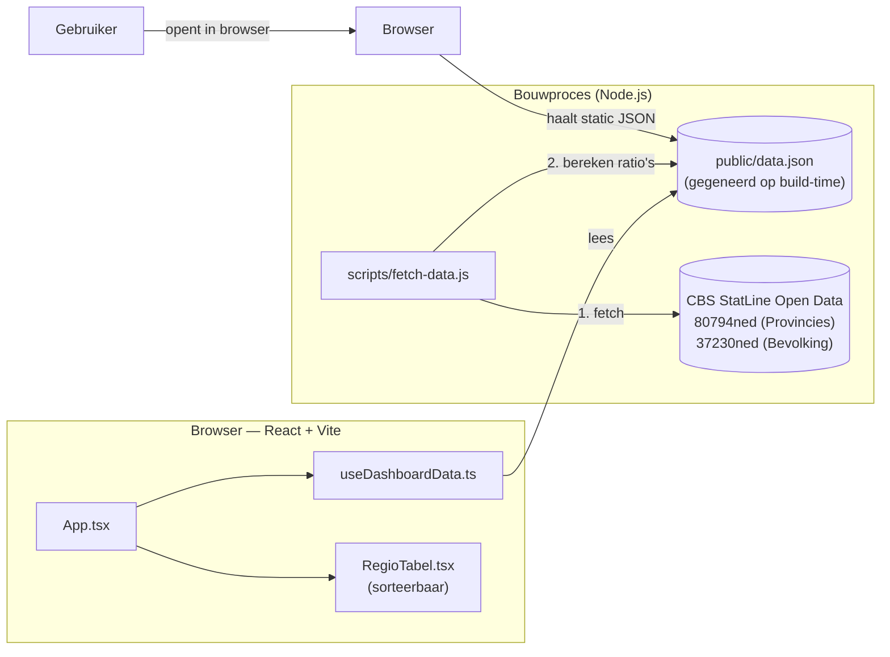

# Architectuur — Regionaal Dashboard Inclusieve Arbeidsmarkt (v0.2)

Een razendsnelle, gestripte single-page applicatie (SPA) die actuele regionale verschillen in uitkeringen en arbeidsongeschiktheid in kaart brengt. Het dashboard bestaat uitsluitend uit een interactieve provincietabel.

> **Let op:** Voor de volledige versie (v0.1) met KPI's, trendgrafieken en automatische signalen, zie de branch `20260625` in de Git-historie.

## Architectuur v0.2



Er is **geen eigen backend of actieve runtime database** nodig. De data wordt via een build-script (`npm run update-data`) opgeslagen in een statisch JSON-bestand. Hierdoor is de applicatie extreem snel, schaalbaar en veilig.

## Mapstructuur

```
sessie-06/
├── README.md                 ← instructies
├── ARCHITECTUUR.md           ← dit document
├── DEFINITIES.md             ← datawoordenboek (wat betekent elke tabelkolom)
├── VERHAALLIJN.md            ← het doel en verhaal van het dashboard
└── app/
    ├── package.json          ← o.a. het `update-data` script
    ├── scripts/
    │   └── fetch-data.js     ← haalt data bij CBS en maakt data.json
    ├── public/
    │   └── data.json         ← de output data, geconsumeerd door React
    └── src/
        ├── App.tsx           ← hoofdcomponent
        ├── types/index.ts    ← TypeScript definities (RegioData)
        ├── hooks/
        │   └── useDashboardData.ts
        └── components/
            └── tables/
                └── RegioTabel.tsx ← de enige UI-component
```

## Techkeuzes in het kort

| Onderdeel | Keuze | Waarom |
|-----------|-------|--------|
| Frontend | Vite + React + TypeScript | Snelste dev-server, type-veilig |
| Styling | Tailwind CSS | Snel, flexibel |
| Data ophalen | Statische build stap (Node.js) | Geen trage API-calls voor de eindgebruiker, geen backend nodig. |
| Databron | CBS StatLine Open Data | Echte, openbare cijfers (80794ned en 37230ned). |
