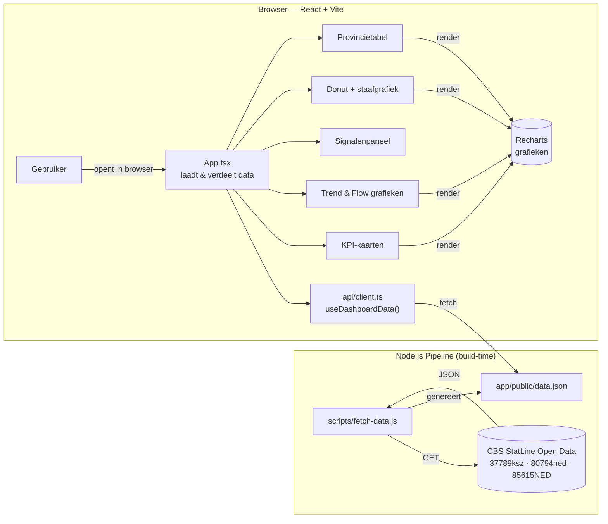

# Architectuur — Dashboard Inclusieve Arbeidsmarkt

Een **signaaldashboard** dat ontwikkelingen rond uitkeringen, arbeidsongeschiktheid en
regionale verschillen in één oogopslag zichtbaar maakt.

Sinds de refactor in Sessie 06 is de architectuur gewijzigd om de prestaties en schaalbaarheid te verbeteren. De API calls worden nu gebouwd op *build time* (of periodiek via een script) in plaats van *runtime* in de browser van de gebruiker.

## Architectuur



Er is bewust **geen eigen backend of actieve database**: CBS levert de data, en we gebruiken een eenvoudig script om deze statisch vast te leggen. Dat houdt de stack zo eenvoudig mogelijk, maakt de frontend bliksemsnel, en zorgt dat we niet tegen CORS-problemen of API-limits van de client browser aanlopen.

## Datastroom

1. **Pipeline (periodiek of pre-build):**
   - `npm run update-data` draait `scripts/fetch-data.js` in Node.
   - Het script haalt data op bij CBS (37789ksz, 80794ned, 85615NED).
   - Het script transformeert de tabellen en leidt de **signalen** af.
   - Slaat het resultaat op in `public/data.json`.
2. **Frontend (live):**
   - Gebruiker opent de webapp.
   - `useDashboardData.ts` doet een simpele fetch naar `/data.json`.
   - React rendert direct alle grafieken, tabellen en afgeleide signalen.

## Mapstructuur

```
sessie-06/
├── README.md                 ← algemene beschrijving
├── ARCHITECTUUR.md           ← dit document
├── VERHAALLIJN.md            ← de inhoudelijke uitleg achter de getallen
├── DEFINITIES.md             ← definities en exacte bronnen
├── dev.sh                    ← start de dev-server
└── app/
    ├── package.json          ← bevat 'update-data' script
    ├── scripts/
    │   └── fetch-data.js     ← data pipeline die CBS omzet in data.json
    ├── public/
    │   └── data.json         ← output van pipeline, input voor frontend
    └── src/
        ├── main.tsx          ← mount React in de pagina
        ├── App.tsx           ← hoofdscherm
        ├── types/
        │   └── index.ts      ← TypeScript definities
        ├── api/
        │   └── client.ts     ← fetch('/data.json')
        ├── hooks/
        │   └── useDashboardData.ts
        └── components/
            ├── layout/       ← KpiCard, SignalenPanel
            ├── charts/       ← TrendChart, FlowChart, Donut, StaafVerdeling
            └── tables/       ← RegioTabel
```

## Techkeuzes in het kort

| Onderdeel | Keuze | Waarom |
|-----------|-------|--------|
| Frontend | Vite + React + TypeScript | Snelste dev-server, type-veilig |
| Styling | Tailwind CSS | Snel, flexibel (geen overheidshuisstijl gewenst) |
| Grafieken | Recharts | Eenvoudige, mooie React-grafieken |
| Data | Statische data.json via Node script | Bliksemsnelle frontend, geen CORS-ellende of client-side limits |

Zie **`VERHAALLIJN.md`** voor het inhoudelijke verhaal en **`DEFINITIES.md`** voor de betekenis en exacte CBS-bron van elk getal.
